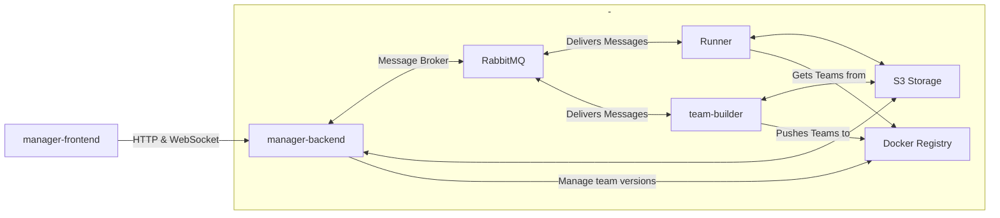
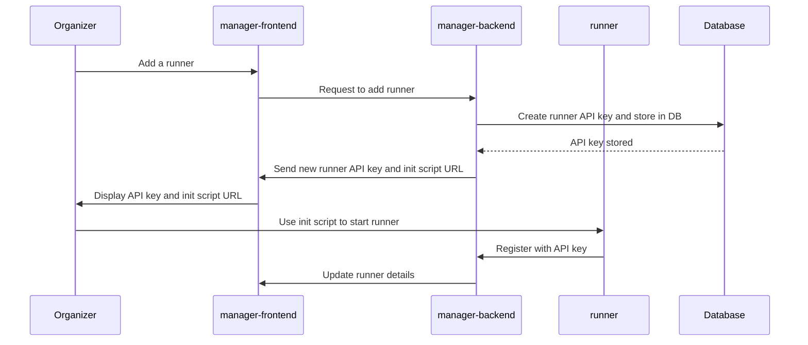
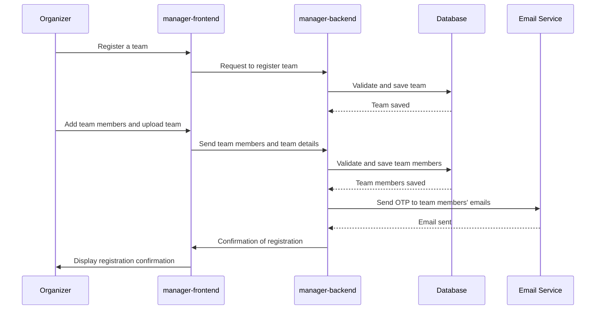
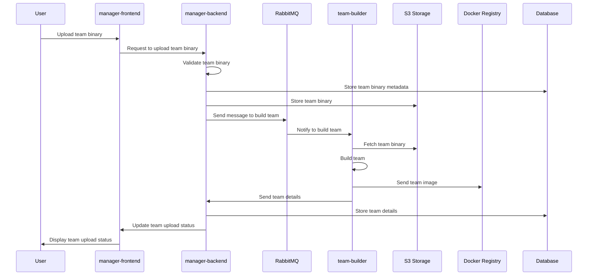
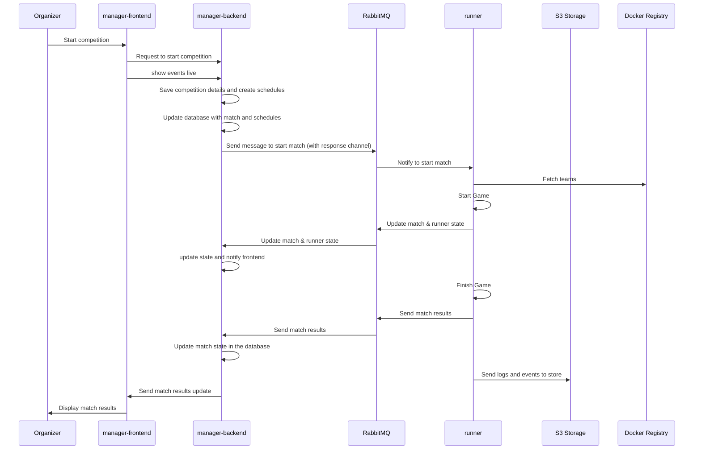

# System Design
Table of Contents
=================

* [Introduction](#introduction)
* [Components](#components)
    * [manager-frontend](#manager-frontend)
    * [manager-backend](#manager-backend)
    * [runner](#runner)
    * [team-builder](#team-builder)
    * [RabbitMQ](#rabbitmq)
    * [S3 Storage](#s3-storage)
    * [Docker Registry](#docker-registry)
* [Data Flow](#data-flow)
* [Flows](#flows)
    * [Add a runner](#add-a-runner)
    * [Register a Team](#register-a-team)
    * [Upload a Team Binary](#upload-a-team-binary)
    * [Run A Match](#run-a-match)

## Introduction

The system is composed of the following components:
- **manager-frontend**

    The web application that provides a user-friendly interface to create and manage competitions, teams, and matches.

- **manager-backend**

    The backend application that provides the business logic and data access layer for the frontend application.

- **runner**
    
    The application that runs the matches and sends the results to the manager-backend.

- **team-builder**
    
    The application that builds the teams and sends them to the manager-backend.

- **RabbitMQ**

    The message broker that handles the communication between the components.

- **S3 Storage**

    The storage service that stores the teams and the logs.

- **Docker Registry**

    The registry that stores the team images.

## Components

### manager-frontend

The `manager-frontend` is the user-facing component that allows users to interact with the system. Through this web application, users can create and manage competitions, teams, and matches. It communicates with the `manager-backend` via HTTP and WebSocket protocols to fetch and update data.

### manager-backend

The `manager-backend` serves as the core of the system, handling business logic and providing a data access layer for the `manager-frontend`. It interacts with other systems, such as the S3 storage, Docker Registry, and RabbitMQ message broker, to manage team versions, retrieve logs, and handle other operations essential for the system's functionality.

### runner

The `runner` is responsible for running the matches. It receives messages from the RabbitMQ message broker, executes the necessary computations, and sends the results back to the `manager-backend`. It also interacts with S3 storage and Docker Registry to fetch teams and their related configurations. and it is horizontally scalable to handle multiple matches concurrently.

### team-builder

The `team-builder` application is in charge of building and preparing teams for the competition. It listens for messages from RabbitMQ, processes team configurations, and pushes the built team images to the Docker Registry and updates related data in S3 storage.

### RabbitMQ

RabbitMQ acts as the message broker within the system, facilitating communication between various components. It ensures that messages (tasks, results, updates) are reliably transferred between the `manager-backend`, `runner`, and `team-builder`.

### S3 Storage

S3 storage is employed to store teams, logs, and other related data. Various components, including `manager-backend`, `runner`, and `team-builder`, interact with S3 storage to read and write data, ensuring consistency and persistence across the system.

### Docker Registry

The Docker Registry is utilized to store and manage team images. The `team-builder` pushes built team images to the registry, and the `runner` pulls these images when executing matches. This ensures that only the latest and validated team configurations are used in the competition.

## Data Flow

The data flow within the system ensures smooth communication and coordination between the different components:

1. **User Interaction**: Users interact with the `manager-frontend` for various operations like creating teams, starting matches, etc.

2. **Backend Processing**: `manager-frontend` sends HTTP and WebSocket requests to `manager-backend` for processing.

3. **Message Passing**: `manager-backend` sends messages to RabbitMQ for tasks like building teams and running matches.

4. **Task Execution**: `runner` and `team-builder` receive messages from RabbitMQ and execute the tasks accordingly.

5. **Data Storage**: `runner` and `team-builder` interact with S3 storage and Docker Registry to fetch necessary data and store results or team images.

6. **Result Communication**: The results or outcomes from `runner` and `team-builder` are sent back to the `manager-backend` via RabbitMQ.

7. **Data Presentation**: `manager-backend` processes the results and updates `manager-frontend`, allowing users to see the latest data on their web application.

This data flow ensures that each component efficiently plays its role, contributing to the overall functionality and reliability of the system.

## Flows

### Add a runner
* **Organizer** interacts with the `manager-frontend` to add a runner.
* `manager-frontend` sends a request to `manager-backend` to add a runner.
* `manager-backend` create a new runner api key and store it in the database.
* `manager-backend` sends frontend the new runner api key and url of the init script for runner
* `manager-frontend` shows the new runner api key and url of the init script for runner.
* **Organizer** uses the init script to start the runner.
* `runner` starts and register itself with the `manager-backend` api.
* **Organizer** update runner detail in the `manager-frontend`.

### Register a Team
* **Organizer** interacts with the `manager-frontend` to register a team.
* `manager-frontend` sends a request to `manager-backend` to register a team.
* `manager-backend` validates the team and store it in the database.
* **Organizer** add team members and upload the team to the `manager-frontend`.
* `manager-frontend` sends team members and team to `manager-backend`.
* `manager-backend` validates the team members and store it in the database.
* `manager-backend` sends email with one time password to team member's email.

### Upload a Team Binary
* **User** interacts with the `manager-frontend` to upload a team binary.
* `manager-frontend` sends a request to `manager-backend` to upload a team binary.
* `manager-backend` validates the team binary and store it in the database.
* `manager-backend` store the team binary to the S3 storage.
* `manager-backend` sends a message to RabbitMQ to build the team.
* `team-builder` receives the message from RabbitMQ and start building the team.
* `team-builder` fetches the team binary from S3 storage and build the team.
* `team-builder` sends the team image to the Docker Registry.
* `team-builder` sends the team details to the `manager-backend`.
* `manager-backend` store the team details in the database.

### Run A Match

* **Organizer** interacts with the `manager-frontend` to start a competition.
* `manager-frontend` sends a request to `manager-backend` to start a competition.
*`manager-frontend` has live event feed of match and progress of the match.
* `manager-backend` stores the competition details and create schedules and matches for the competition and store it in the database.
* `manager-backend` find a free runner to run the match and send a message to RabbitMQ to start the match and assign a response channel to collect the results.
* `runner` receives the message from RabbitMQ and start the match process, at same time `manager-backend` updates the match & runner state in the database.
* `runner` fetches the teams from the docker registry and start the match.
* `runner` sends the progress of the match to RabbitMQ.
* `runner` finishes the match and sends the results to RabbitMQ.
* `manager-backend` receives the results and updates the match state in the database.

