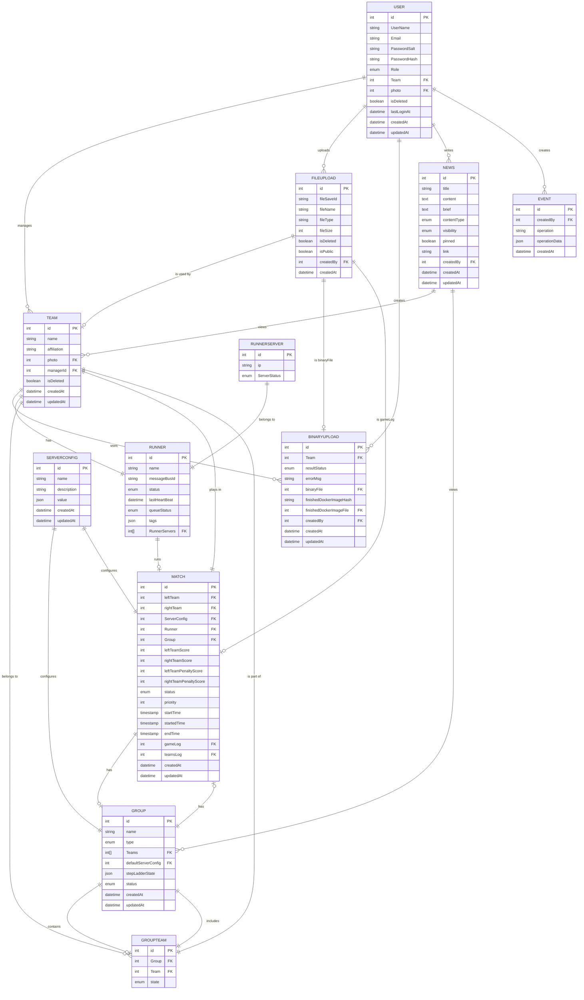

# Sugesstion

## Backend API

### Team Manager

- /api/team/createNewTeam TeamName
- /api/team/createTeamsFromFile TeamsFile
- /api/team/createTeams Teams
- /api/team/addUserToTeam TeamName UserName
- /api/team/removeUserFromTeam TeamName UserName
- /api/team/deleteTeam TeamName
- /api/team/getTeamUsers TeamName
- /api/team/getAllTeams
- /api/team/getTeam TeamName
- /api/team/changeTeamName TeamName NewTeamName

### User Manager

- /api/user/createNewUser UserName Email Password Role[Admin, Visitor, TeamManager] [TeamName]
- /api/user/createUsersFromFile UsersFile
- /api/user/createUsers Users
- /api/user/deleteUser UserName
- /api/user/getUser UserName
- /api/user/getAllUsers
- /api/user/changeUserRole UserName Role
- /api/user/changeUserPassword UserName Password
- /api/user/changeUserEmail UserName Email
- /api/user/changeUserName UserName NewUserName
- /api/user/changeUserTeam UserName TeamName

### News Manager

- /api/news/createNewNews Title Content ContentType[text,html,markdown,googleDoc, ...] Visibility[public, team, ...] pinned[true, false]
- /api/news/deleteNews NewsId
- /api/news/getNews NewsId
- /api/news/getAllNews
- /api/news/changeNewsTitle NewsId NewTitle
- /api/news/changeNewsContent NewsId NewContent
- /api/news/changeNewsVisibility NewsId NewVisibility
- /api/news/changeNewsPinned NewsId NewPinned

### Email Manager

- /api/email/addEmailSmtp Email
- /api/email/removeEmailSmtp Email
- /api/email/sendEmailToAllUsers Title Content
- /api/email/sendEmailToUsers Title Content Users
- /api/email/sendEmailToTeams Title Content Teams

### Group Manager

- /api/createNewGroup GroupName GroupType[group, steplader, ...] [Teams] ServerConfigName[starter, major, ...] [ServerConfigs]
- /api/deleteGroup GroupName
- /api/getGroup GroupName
- /api/getAllGroups
- /api/AddTeamToGroup GroupName TeamName
- /api/removeTeamFromGroup GroupName TeamName
- /api/changeGroupName GroupName NewGroupName
- /api/changeGroupType GroupName NewGroupType
- /api/changeGroupServerConfig GroupName NewServerConfigName
- /api/createGames GroupName

### Runner Manager

### Game Manager

- /api/createNewGame Teams ServerConfigs groupName [RunngerName] [ServerNumber]
- /api/deleteGame GameId
- /api/getGame GameId
- /api/getAllGames
- /api/endGame GameId Results Status
- /api/stopGame GameId
- /api/prioritizeGame GameId Priority
- /api/reAddGame GameId

### Server Config Manager

- /api/uploadMainServerConfig configFile
- /api/getMainServerConfigs
- /api/addServerConfig ServerConfigName Config
- /api/deleteServerConfig ServerConfigName
- /api/getServerConfig ServerConfigName
- /api/changeServerConfig ServerConfigName Config

## Database Models

### User

- id
- UserName
- Email
- PasswordSalt
- PasswordHash
- Role[Admin, Visitor, TeamManager, TeamMember]
- > Team
- photo > FileUpload
- isDeleted
- lastLoginAt
- createdAt
- updatedAt

### Team
- id
- name
- affiliation
- photo > FileUpload
- managerId > User
- isDeleted
- createdAt
- updatedAt

### BinaryUpload

- > Team
- resultStatus [Pass, Fail, NotChecked]
- errorMsg
- binaryFile > FileUpload
- finishedDockerImageHash
- finishedDockerImageFile > FileUpload
- createdBy > User
- createdAt
- updatedAt

### FileUpload
- id 
- fileSaveId
- fileName
- fileType
- fileSize
- isDeleted
- isPublic
- createdBy > User
- createdAt

### ServerConfig
- id
- name
- description
- value [json]
- createdAt
- updatedAt

### News
- id
- title
- content
- brief
- contentType [text,html,markdown,googleDoc, ...]
- visibility [public, team, ...]
- pinned [true, false]
- link
- createdBy > User
- createdAt
- updatedAt

### Runner
- id
- name
- messageBusId
- status [up, down, non-responsive]
- lastHeartBeat
- queueStatus [running, waiting, stopped]
- tags [Array]
- > RunnerServers

### RunnerServer
- id
- ip
- ServerStatus [running, waiting]

### Group
- id
- name
- type [group, steplader, ...]
- >> Teams
- defaultServerConfig > ServerConfig
- stepLadderState [json]
- status [noStatus, running, ended, stopped]
- createdAt
- updatedAt

### Group-Team
- id
- > Group
- > Team
- state [lost]

### Match
- id
- leftTeam > Team
- rightTeam > Team
- > ServerConfig
- ?> Runner
- ?> Group
- leftTeamScore
- rightTeamScore
- leftTeamPenaltyScore
- rightTeamPenaltyScore
- status [noStatus,error , inQueue, running, ended, stopped]
- priority
- startTime [timestamp]
- startedTime [timestamp]
- endTime [timestamp]
- gameLog > FileUpload
- teamsLog > FileUpload
- createdAt
- updatedAt

### Events
- id
- createdBy > User
- operation 
- operationData [json]
- createdAt
